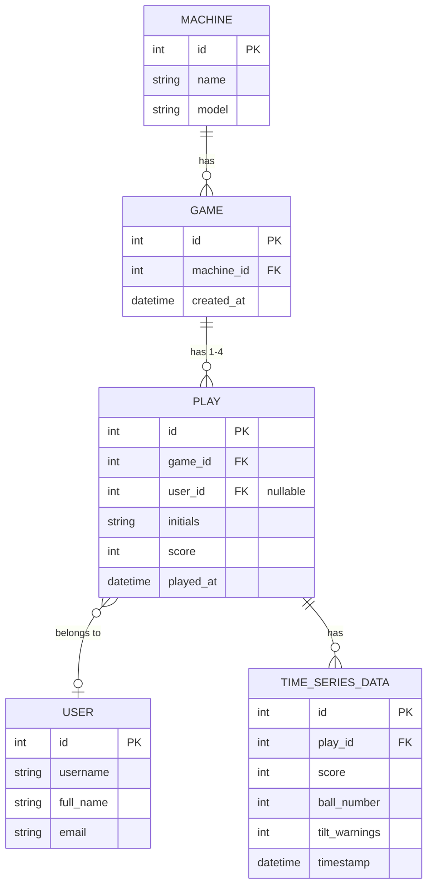

# bragboard

## Database Structure

The following ER diagram represents the data model for the pinball leaderboard application:

### Entity Relationships

- **Machine**: Represents a physical pinball machine
- **Game**: A session on a specific machine
- **Play**: An individual player's turn within a game (1-4 players per game)
- **User**: A registered user who can be linked to plays
- **Time Series Data**: Detailed metrics tracking score over time, ball in play, and tilt warnings
