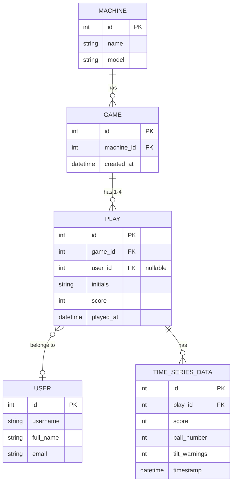

# bragboard

## Database Structure

The following ER diagram represents the data model for the pinball leaderboard application:

### Entity Relationships

- **Machine**: Represents a physical pinball machine
- **Game**: A session on a specific machine
- **Play**: An individual player's turn within a game (1-4 players per game)
- **User**: A registered user who can be linked to plays
- **Time Series Data**: Detailed metrics tracking score over time, ball in play, and tilt warnings

### Bragboard dev TODO list

- [x] make vector report IP address
- [x] grab high scores from each vector baord
- [ ] write web UI to display high scores
    - [x] API routes to get high scores
    - [ ] scroll through high scores within one game
    - [ ] "slide show" of games
- [ ] make vector broadcast live game data
    - [ ] Collect live data in db
    - [ ] stream live data to web UI
- [ ] pull in backglass images
- [ ] make vector self-assign a guid
